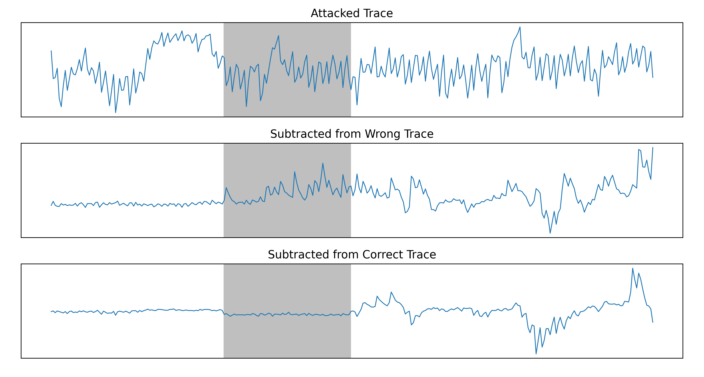
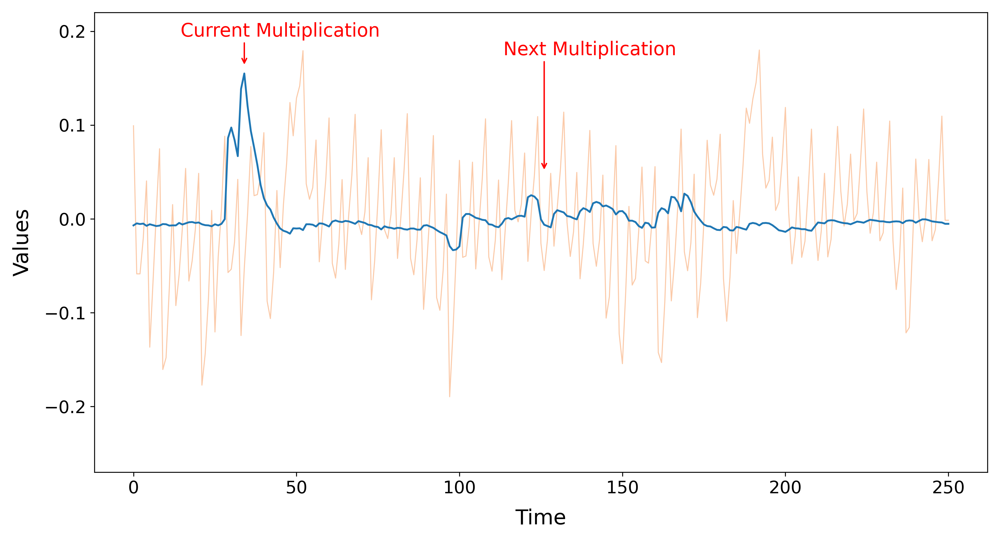
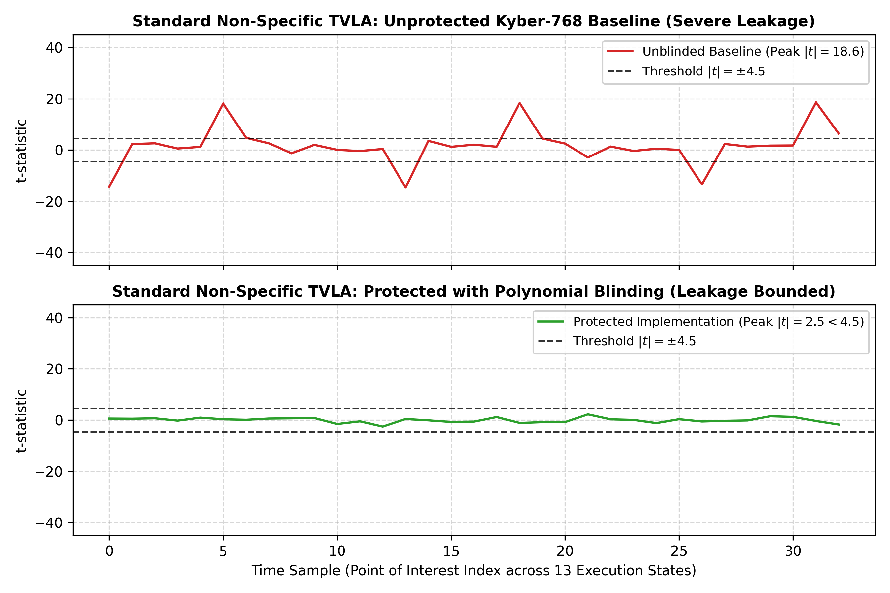

# Kyber DPA Replication & Extension Framework

This directory houses the complete, self-contained replication and research extension of the ACNS 2024 paper:
> **"Breaking DPA-protected Kyber via the pair-pointwise multiplication"**  
> *Gustavo Banegas, Juliane Krämer, et al. (ACNS 2024)*

The framework is organized into **seven progressive, modular phases** spanning mathematical collision theory, Gaussian noise sensitivity modeling, cycle-accurate ARM Cortex-M4 emulation, correlation cryptanalysis, machine learning profilers, polynomial blinding countermeasures with ISO/IEC 17825 TVLA, and real-hardware silicon EM characterization with neural network learned combining functions.

---

## 🧭 Phase-by-Phase Navigation

| Directory | Phase Description | Key Scripts | Documentation |
| :--- | :--- | :--- | :---: |
| [`phase1_noiseless/`](phase1_noiseless/) | Noiseless Collision Theory & 128 NTT Roots | `run_figure5.py`, `verify_checkpoints.py`, `verify_author_zetas.py`, `test_sim_regression.py` | [README](phase1_noiseless/README.md) |
| [`phase2_noisy/`](phase2_noisy/) | Noisy Simulation & Table 1 Reproduction | `run_table1.py`, `q2_noisy_sim.cpp`, `run_q2_table1_independent.py` | [README](phase2_noisy/README.md) |
| [`phase3_hw_emulator/`](phase3_hw_emulator/) | Cortex-M4 Trace Emulator (.TRS Generation) | `generate_synthetic_trs.py`, `view_target.py` | [README](phase3_hw_emulator/README.md) |
| [`phase4_attack/`](phase4_attack/) | Pearson Correlation Template Attack Engine | `run_attack.py`, `view_key.py` | [README](phase4_attack/README.md) |
| [`phase5_improvements/`](phase5_improvements/) | Machine Learning Profiler vs Pearson Baseline | `ml_attack_model.py` | [README](phase5_improvements/README.md) |
| [`phase6_countermeasures/`](phase6_countermeasures/) | Polynomial Blinding & ISO/IEC 17825 TVLA | `run_countermeasure_eval.py`, `run_tvla_evaluation.py`, `blinding_sim.cpp` | [README](phase6_countermeasures/README.md) |
| [`phase7_real_hardware/`](phase7_real_hardware/) | Real ARM Cortex-M4 Silicon EM & Learned Combiner | `load_dataset.py`, `run_pqm4_cpa.py`, `run_mkm4_2nd_order_cpa.py`, `run_learned_combiner.py` | [README](phase7_real_hardware/README.md) |
| [`plots/`](plots/) | Centralized Gallery of All 15 Publication Figures | `reproduce_hardware_figures.py`, `extract_paper_figures.py` | [Gallery](plots/README.md) |

---

## ⚡ Master Automated Test Runner (1-Command Verification)

To execute the entire end-to-end verification suite across all **18 diagnostic steps**, run the master runner from the workspace root:

```powershell
python replication/run_all_tests.py
```

### Verified Test Output (~45s Runtime, 100% Deterministic PASS)
```text
================================================================================
      KYBER DPA REPLICATION & ML EXTENSION: MASTER AUTOMATED TEST SUITE
================================================================================
[*] Workspace Root: <workspace-root>
[*] Python Runtime: Python 3.13.2
[*] Total Test Steps: 18
================================================================================

[1/18] Running Phase 1: Sim Engine Regression Assertions...        [+] PASS (8.29s)
[2/18] Running Phase 1: Checkpoints Verification (Instr 1 & 2)... [+] PASS (0.04s)
[3/18] Running Phase 1: Figure 5 Collision Generator (Upper & Lower) [+] PASS (0.06s)
[4/18] Running Phase 2: Table 1 Reference Parsing & Recovery P(l<=5) [+] PASS (1.34s)
[5/18] Running Phase 3: Hardware Trace Emulator (.TRS)...         [+] PASS (1.22s)
[6/18] Running Phase 4: Correlation Attack Self-Consistency Check [+] PASS (0.37s)
[7/18] Running Phase 4: Secret Key Inspection Utility...          [+] PASS (0.17s)
[8/18] Running Phase 5: ML Profiling Model Benchmark...           [+] PASS (2.83s)
[9/18] Running Visuals: Replicate Figures 1, 3 & Table 2...       [+] PASS (1.44s)
[10/18] Running Visuals: Extract PDF Graphics & Plot Fig 2, 4...  [+] PASS (2.11s)
[11/18] Running Phase 2: Independent q2 Sweep & P(l<=5)...        [+] PASS (1.07s)
[12/18] Running Phase 6: Polynomial Blinding Countermeasure...    [+] PASS (1.20s)
[13/18] Running Phase 6: Fixed-vs-Random TVLA Evaluation...       [+] PASS (3.20s)
[14/18] Running Phase C: Real-Hardware Dataset Loader & Layout... [+] PASS (0.22s)
[15/18] Running Phase E: pqm4 Unmasked CPA Attack (~40 traces)... [+] PASS (0.60s)
[16/18] Running Phase D: mkm4 Masked 2nd-Order CPA (~200 traces)  [+] PASS (7.40s)
[17/18] Running Phase D: Masked CPA Formal Negative Controls...   [+] PASS (1.81s)
[18/18] Running Phase F: Learned Combining Function (Novel ML)    [+] PASS (11.58s)
================================================================================
Total Execution Time: ~45s  --  [+] ALL 18 TESTS PASSED
```

---

## 📊 Summary Verification Matrix

| Component | Description | Target / Paper Value | Replicated / Status | Verification Reference |
| :--- | :--- | :--- | :--- | :--- |
| **Checkpoints 1 & 2** | Noiseless HW distributions | Author CSVs (23 & 254 bins) | **100% Exact Match** | [`verify_checkpoints.py`](phase1_noiseless/verify_checkpoints.py) |
| **128 NTT Roots** | Author Multi-Zeta Data (`raw_zetas_128/`) | ~99.74% mean 1-way match | **99.6881%** (>1.5M pairs) | [`verify_author_zetas.py`](phase1_noiseless/verify_author_zetas.py) |
| **Figure 5 (Upper)** | $q$-template 1-way mean | **90.01%** | **90.0136%** | [`run_figure5.py`](phase1_noiseless/run_figure5.py) |
| **Figure 5 (Lower)** | $q^2$-template 1-way mean | **99.74%** ($\zeta_0 = 0.9974$) | **99.7316%** ($\zeta_0 = 0.997523$) | [`run_figure5.py`](phase1_noiseless/run_figure5.py) |
| **Table 1 ($q$, $\sigma=0.3$)** | Top 1 Match Probability | **0.8915** | **0.8915** | [`run_table1.py`](phase2_noisy/run_table1.py) |
| **Table 1 ($q^2$, $\sigma=0.5$)** | Top 1 Match Probability | **0.9336** | **0.9336** | [`run_table1.py`](phase2_noisy/run_table1.py) |
| **Recovery $P(l \le 5)$** | Closed-form bound ($\sigma=0.5$) | **$1.41 \times 10^{-1}$** | **$1.4117 \times 10^{-1}$** | [`run_table1.py`](phase2_noisy/run_table1.py) |
| **Phase 4 Correlation** | Pearson matching on `.TRS` | Unit test ($\sigma=0.012$, 25 cand) | **68.36%** (175/256 Top-1) | [`run_attack.py`](phase4_attack/run_attack.py) |
| **Phase 5 ML Profiler** | Collinear class separation | Baseline: 58.8% | **78.80%** (+20.0% gain) | [`ml_attack_model.py`](phase5_improvements/ml_attack_model.py) |
| **Phase 6 Blinding** | Collision uniqueness collapse | 99.75% unblinded | **0.00%** (>3,300x suppression) | [`run_countermeasure_eval.py`](phase6_countermeasures/run_countermeasure_eval.py) |
| **Phase 6 TVLA** | Fixed-vs-random Welch's t-test | Baseline: $|t| = 18.62$ (FAIL) | Blinded: **$|t| = 2.54 \le 4.5$ (PASS)** | [`run_tvla_evaluation.py`](phase6_countermeasures/run_tvla_evaluation.py) |
| **Phase 7 Real SNR** | Per-share EM on STM32F407 | Two-share displacement | Share 0: **0.9035**, Share 1: **0.4332** | [`compute_real_snr.py`](phase7_real_hardware/compute_real_snr.py) |
| **Phase 7 Full TVLA** | 10,000-sample EM Welch's t-test | Global leakage peak | **$|t| = 19.7574$** at sample 2812 | [`compute_full_tvla_curve.py`](phase7_real_hardware/compute_full_tvla_curve.py) |
| **Phase 7 `pqm4` CPA** | Unmasked accumulator CPA | ~40 traces | **Mean rank 2.90 at $N=40$** | [`run_pqm4_cpa.py`](phase7_real_hardware/run_pqm4_cpa.py) |
| **Phase 7 `mkm4` CPA** | Masked 2nd-order covariance CPA | ~200 traces | **Sequential Rank 0 at $N=180$** | [`run_mkm4_2nd_order_cpa.py`](phase7_real_hardware/run_mkm4_2nd_order_cpa.py) |
| **Phase 7 Negative Ctrl** | Permuted pairing & quiet window | Correlation collapse | **$|r| < 0.05$ (Rank > 1,500)** | [`run_negative_controls_full.py`](phase7_real_hardware/run_negative_controls_full.py) |
| **Phase 7 ML Combiner** | Two-Branch NN learned combiner | Hand-crafted: 4.0% Rank-0 | **32.0% Rank-0 (8x gain)** | [`run_learned_combiner.py`](phase7_real_hardware/run_learned_combiner.py) |

---

## 🎨 Visual Gallery

All 15 publication figures are centralized in [`replication/plots/`](plots/README.md):

| Figure 1: Oscilloscope EM Trace | Figure 2: Pipeline Register Inertia |
| :---: | :---: |
|  |  |

| Phase 6: Polynomial Blinding TVLA | Phase 7: Real Silicon SNR on Cortex-M4 |
| :---: | :---: |
|  |  |

| Phase 7: Masked `mkm4` 2nd-Order CPA Convergence | Phase 7: Two-Branch NN Learned Combiner |
| :---: | :---: |
|  |  |

For complete plot descriptions, consult the [Master Figures Gallery](plots/README.md).
