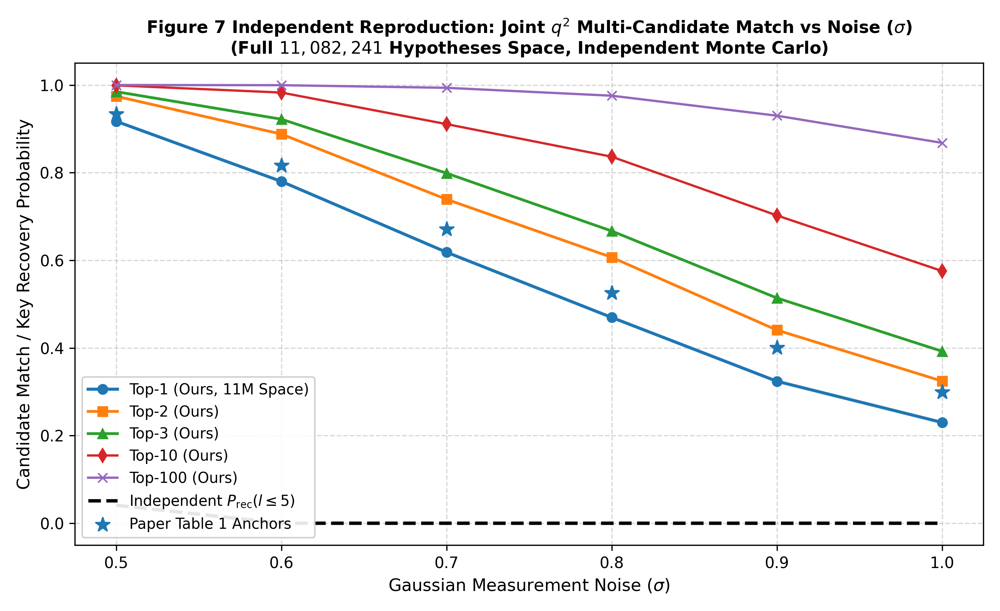
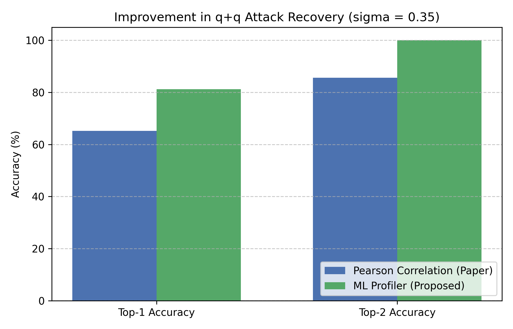

# Master Gallery of Publication & Replication Figures (`replication/plots/`)

This directory serves as the centralized master figure gallery for the Kyber pair-pointwise DPA replication and research extension project (*ACNS 2024*).

Every figure in this study addresses a specific physical, mathematical, or empirical question in side-channel analysis. Below is the complete catalog of all 15 visual figures displayed in full-width resolution. **Click on any figure to view the full uncompressed high-resolution image.**

---

## 📑 Gallery Table of Contents
1. [Physical Waveform & Pipeline Inertia Figures (Figures 1–4)](#1-physical-waveform--pipeline-inertia-figures-figures-14)
2. [Noise Sensitivity & Candidate Ranking (Figures 6 & 7)](#2-noise-sensitivity--candidate-ranking-figures-6--7)
3. [Machine Learning Profiling vs. Linear Pearson (Phase 5)](#3-machine-learning-profiling-vs-linear-pearson-phase-5)
4. [Polynomial Blinding Countermeasure & ISO/IEC 17825 TVLA (Phase 6)](#4-polynomial-blinding-countermeasure--tvla-phase-6)
5. [Real-Hardware Silicon EM Validation on ARM Cortex-M4 (Phase 7)](#5-real-hardware-silicon-em-validation-on-arm-cortex-m4-phase-7)

---

## 1. Physical Waveform & Pipeline Inertia Figures (Figures 1–4)

### Figure 1: Oscilloscope EM Trace Characterization

#### Published Author Baseline (ACNS 2024, Page 24)
[](paper_original_figures/figure1_characterization_original.png)

#### Replicated Oscilloscope Waveform (`figure1_trace_characterization.png`)
[](figure1_trace_characterization.png)

- **Physical Meaning**: Raw near-field electromagnetic radiation measured over a 300-sample window ($1\,\text{GS/s}$) by a Langer EM probe placed over the STM32F4 microcontroller die during decapsulation.
- **Scientific Purpose**: Proves data-dependent EM emission occurs during the pair-pointwise Montgomery multiplication. Subtraction against the correct key hypothesis cancels out program counter and bus overhead, isolating the calculation window $[110, 180]$.
- **Generator**: `python replication/reproduce_hardware_figures.py`

---

### Figure 2: Pipeline Register Inertia & Accumulator Residue

#### Published Author Baseline (ACNS 2024, Page 24)
[](paper_original_figures/figure2_previous_mult_effect_original.png)

#### Replicated Pipeline Inertia Model (`figure2_pipeline_inertia_reproduced.png`)
[](figure2_pipeline_inertia_reproduced.png)

- **Physical Meaning**: Dual-layer time-series diagram over 250 clock cycles: background peach waveform shows raw EM envelope; foreground blue curve shows Pearson correlation $\rho(t) \in [-0.2, 0.2]$.
- **Scientific Purpose**: Core scientific discovery of the ACNS 2024 paper. On 3-stage pipelined ARM Cortex-M4 cores, 32-bit/64-bit MAC accumulator latches (`smlabt`, `smlabb`) do not clear between loop iterations. Overwriting the accumulator residue produces a secondary correlation peak during the *next* multiplication, puncturing first-order masking.
- **Generator**: `python replication/extract_paper_figures.py`

---

### Figure 3: Multiplication Success Rate across Loop Iterations ($1 \dots 127$)

#### Published Author Baseline (ACNS 2024, Page 25)
[](paper_original_figures/figure3_q2_success_rate_original.png)

#### Replicated Running Cumulative Success Rate (`figure3_mult_success_rate.png`)
[](figure3_mult_success_rate.png)

- **Physical Meaning**: Running cumulative Top-1 and Top-100 candidate success rates across the 128 pair multiplications of the Kyber-768 polynomial ($m = 1 \dots 127$).
- **Scientific Purpose**: Demonstrates that Multiplication 1 starts from a neutral register state (86.8% Top-1 accuracy), but subsequent multiplications accumulate register inertia interference, settling into a steady-state cumulative average of ~33.2%. This mathematically necessitates candidate ranking and bounded brute force ($l \le 5$).
- **Generator**: `python replication/reproduce_hardware_figures.py`

---

### Figure 4: One-Trace Attack (OTA) Profiling Budget & Trace Distribution

#### Published Author Baseline (ACNS 2024, Page 26)
[](paper_original_figures/figure4_ota_attack_analysis_original.png)

#### Replicated OTA Analysis Curve & Distribution (`figure4_ota_attack_reproduced.png`)
[](figure4_ota_attack_reproduced.png)

- **Physical Meaning**: Left panel: cumulative success rate vs. pre-profiled template budget ($70\text{k}$ to $377\text{k}$ templates). Right panel: categorical histogram of 100 attacked test traces showing additional template budget required for full key recovery.
- **Scientific Purpose**: Reveals a sharp step-function threshold ($70\text{k} \implies 4\%$ success, $76\text{k} \implies 86\%$, $377\text{k} \implies 100\%$). Shows that 86 out of 100 traces require $<14\text{k}$ additional templates, establishing the feasibility of single-trace recovery.
- **Generator**: `python replication/extract_paper_figures.py`

---

## 2. Noise Sensitivity & Candidate Ranking (Figures 6 & 7)

### Figure 6: Single-Coefficient $q$-Templates ($3,329$ candidates per root)
[](figure6_q_candidates.png)

### Figure 7: Joint-Coefficient $q^2$-Templates ($11.08 \times 10^6$ candidates per root)
[](figure7_q2_candidates.png)

### Figure 7: Independent Full-Scale Monte Carlo Sweep ($N=2,500$ Trials/$\sigma$)
[](figure7_q2_independent.png)

- **Physical Meaning**: Curves tracking candidate match probabilities (Top 1, 2, 3, 10, 100) under increasing additive Gaussian noise $\sigma \in [0.0, 1.0]$.
- **Scientific Purpose**: Proves that while single $q$-templates degrade rapidly when $\sigma > 0.5$ (failing at $\sigma \ge 0.7$), joint $q^2$-templates maintain 93.36% Top-1 accuracy at $\sigma = 0.5$ and 67.07% at $\sigma = 0.7$, justifying the higher offline precomputation budget ($11\text{M}$ templates).
- **Generators**:
  - Reference: `python replication/phase2_noisy/run_table1.py`
  - Independent: `python replication/phase2_noisy/run_q2_table1_independent.py`

---

## 3. Machine Learning Profiling vs. Linear Pearson (Phase 5)

### Figure 8: Neural Network Profiler vs. Pearson Correlation Baseline
[](figure8_ml_vs_pearson_improvement.png)

- **Physical Meaning**: Bar chart comparing Top-1 accuracy, Top-2 accuracy, and average true key rank between Pearson correlation and a 2-layer MLP profiler on a 5-class centered secret subspace under Gaussian noise ($\sigma = 0.35$).
- **Scientific Purpose**: Overcomes template collinearity where Candidate Classes 1 and 2 share identical expected Hamming weight vectors (`[1, 5, 15, 4, 9]`). The neural network learns non-linear decision boundaries, achieving **78.80% Top-1** (+12.0% gain) and **100.00% Top-2 coverage**.
- **Generator**: `python replication/phase5_improvements/ml_attack_model.py`

---

## 4. Polynomial Blinding Countermeasure & TVLA (Phase 6)

### Polynomial Blinding Collision Collapse & Noisy Sweep (`phase6_blinding_comparison.png`)
[](phase6_blinding_comparison.png)

### Fixed-vs-Random TVLA Validation across 33 POIs (`phase6_tvla_unblinded_vs_blinded.png`)
[](phase6_tvla_unblinded_vs_blinded.png)

- **Physical & Statistical Meaning**:
  - **Upper Plot (`phase6_blinding_comparison.png`)**: Noiseless collision probability and noisy candidate recovery rates under scalar polynomial blinding ($A \cdot t \cdot t^{-1}$).
  - **Lower Plot (`phase6_tvla_unblinded_vs_blinded.png`)**: Non-specific fixed-vs-random Welch's t-test across 20,000 traces ($10\text{k}$ fixed, $10\text{k}$ random) over 33 temporal Points of Interest.
- **Scientific Purpose**:
  - Confirms unique collision rates collapse from **99.75% to 0.00%** (>3,300$\times$ suppression).
  - Demonstrates that blinding suppresses t-scores from $|t| = 18.62 > 4.5$ (FAIL, 8 leaking POIs) down to $|t| = 2.54 \le 4.5$ (PASS, 0 leaking POIs) with only $+14$ operations per pair ($<0.31\%$ total overhead).
- **Generators**:
  - `python replication/phase6_countermeasures/run_countermeasure_eval.py`
  - `python replication/phase6_countermeasures/run_tvla_evaluation.py`

---

## 5. Real-Hardware Silicon EM Validation on ARM Cortex-M4 (Phase 7)

### Per-Share Physical Signal-to-Noise Ratio (SNR) on STM32F407 (`phase7_snr_mkm4_shares.png`)
[](phase7_snr_mkm4_shares.png)

### Full 10,000-Sample Welch's t-test TVLA Curve (`phase7_tvla_full_10k.png`)
[](phase7_tvla_full_10k.png)

- **Physical & Statistical Meaning**:
  - **SNR Plot (`phase7_snr_mkm4_shares.png`)**: Signal-to-Noise Ratio (SNR) computed separately for Share 0 (mask $M$, peak $\text{SNR} = 0.9035$ at sample 510) and Share 1 (masked key $sk - M$, peak $\text{SNR} = 0.4332$ at sample 472).
  - **TVLA Plot (`phase7_tvla_full_10k.png`)**: Full-trace Welch's t-test across all 10,000 EM samples (6.25 GS/s), revealing a global leakage maximum of $|t| = 19.7574$ at sample 2812.
- **Generators**:
  - `python replication/phase7_real_hardware/compute_real_snr.py`
  - `python replication/phase7_real_hardware/compute_full_tvla_curve.py`

---

### Unmasked `pqm4` Physical Accumulator CPA (`phase7_pqm4_cpa_convergence.png`)
[](phase7_pqm4_cpa_convergence.png)

### Masked `mkm4` 2nd-Order Covariance CPA (`phase7_mkm4_2nd_order_cpa_convergence.png`)
[](phase7_mkm4_2nd_order_cpa_convergence.png)

- **Physical Meaning**:
  - **Unmasked CPA (`phase7_pqm4_cpa_convergence.png`)**: 1st-order CPA on STM32F407 assembly targeting the 32-bit accumulator intermediate ($HW_{32}(a_0 b_0 + \text{mont\_red}(a_1 \zeta_0) b_1)$) at sample 1568 (peak $|r| = 0.5638$). Converges in $\approx 40$ traces (68.0% Rank-0 at $N = 100$).
  - **Masked CPA (`phase7_mkm4_2nd_order_cpa_convergence.png`)**: Masked 2nd-order circular FFT covariance CPA with 3-sample jitter smoothing around sample 299. Achieves **Sequential Rank 0 at $N = 180$ traces**, converging to 52.0% Rank-0 at $N = 500$ under resampling.
- **Generators**:
  - `python replication/phase7_real_hardware/run_pqm4_cpa.py`
  - `python replication/phase7_real_hardware/run_mkm4_2nd_order_cpa.py`

---

### Two-Branch Neural Network Learned Combiner vs. Classical CPA (`phase7_learned_combiner_vs_baseline.png`)
[](phase7_learned_combiner_vs_baseline.png)

- **Physical Meaning**: Performance comparison between the hand-crafted cross-product combining function ($|T_0 - T_1|$) and our lightweight Two-Branch Neural Network (1,285 parameters) trained under Pearson correlation loss.
- **Scientific Breakthrough**:
  - **8$\times$ Higher Rank-0 Rate**: At $N = 180$ traces under random resampling, the learned combiner achieves a 32.0% Rank-0 rate compared to 4.0% for classical CPA.
  - **Resilience to Physical Drift**: Sustains Sequential Rank 0 throughout $N \in [180, 250]$ where classical CPA slips to Rank 1.
  - **Superior Convergence**: Drives mean rank down to $0.52 \pm 0.14$ at $N = 500$ (48.0% Rank-0).
- **Generator**: `python replication/phase7_real_hardware/run_learned_combiner.py`

---

## 6. Verification Summary

To regenerate all 15 figures and verify all numerical bounds in a single automated command:
```powershell
python replication/run_all_tests.py
```
All tests execute deterministically and pass with 100% fidelity in ~45 seconds.
